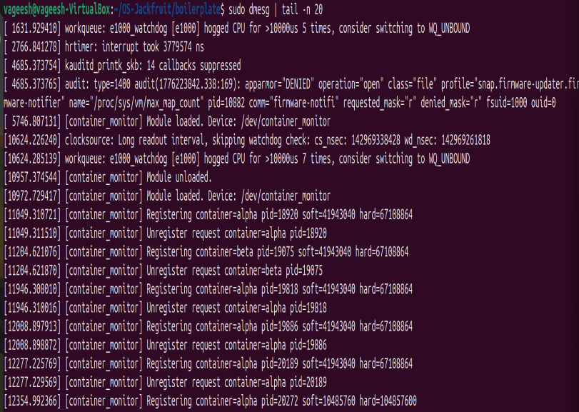
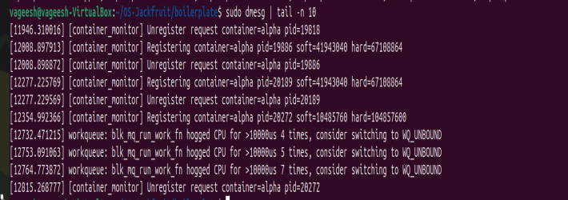

# OS-Jackfruit README Guide

This repository is a starter kit for an Operating Systems project where you build a lightweight Linux container runtime in C, a long-running supervisor, and a kernel-space memory monitor.

This README is meant to help you do two things:

1. understand all files currently present in the repository
2. turn this file into your final submission `README.md`

For the full assignment brief, read [project-guide.md](project-guide.md).

## Repository Overview

```text
OS-Jackfruit-main/
|-- .github/
|   `-- workflows/
|       `-- submission-smoke.yml
|-- .vscode/
|   |-- c_cpp_properties.json
|   |-- launch.json
|   `-- settings.json
|-- boilerplate/
|   |-- Makefile
|   |-- engine.c
|   |-- monitor.c
|   |-- monitor_ioctl.h
|   |-- cpu_hog.c
|   |-- io_pulse.c
|   |-- memory_hog.c
|   `-- environment-check.sh
|-- .gitignore
|-- project-guide.md
`-- README.md
```

## File-By-File Guide

### Top-level files

| Path | Purpose |
| --- | --- |
| `.github/workflows/submission-smoke.yml` | GitHub Actions smoke test for a CI-safe compile check |
| `.vscode/` | VS Code settings for local C/C++ development |
| `.gitignore` | Prevents generated files and local artifacts from being committed |
| `project-guide.md` | Full assignment requirements, tasks, and submission rubric |
| `README.md` | Working guide now, final documentation later |

### `boilerplate/`

| File | Purpose |
| --- | --- |
| `Makefile` | Builds the runtime, workloads, and kernel module |
| `engine.c` | User-space runtime and supervisor starter |
| `monitor.c` | Kernel module starter for memory monitoring |
| `monitor_ioctl.h` | Shared ioctl request definitions between user and kernel space |
| `cpu_hog.c` | CPU-bound workload for scheduling experiments |
| `io_pulse.c` | I/O-oriented workload for scheduling experiments |
| `memory_hog.c` | Memory pressure workload for soft-limit and hard-limit testing |
| `environment-check.sh` | Environment validation and preflight script |

## What The Starter Already Gives You

The repository is partial boilerplate, but several core pieces are already present:

- command grammar in `engine.c` for `supervisor`, `start`, `run`, `ps`, `logs`, and `stop`
- a UNIX domain socket control path at `/tmp/mini_runtime.sock`
- bounded-buffer data structures with mutex and condition variables
- a producer thread skeleton that reads container logs from a pipe
- a consumer thread skeleton that writes log chunks into `logs/<id>.log`
- container launch through `clone()` with PID, UTS, and mount namespaces
- rootfs setup through `chroot()` and `/proc` mounting inside the child
- kernel-device setup for `/dev/container_monitor`
- linked-list based monitor state in kernel space
- helper workloads for memory, CPU, and I/O demonstrations
- a CI-safe `make ci` path used by GitHub Actions

## What You Still Need To Finish

From the TODOs in the code and the assignment guide, the team still needs to implement or strengthen:

- supervisor lifecycle behavior for multiple containers
- metadata synchronization and state tracking
- polished control-plane request handling
- bounded-buffer shutdown correctness
- complete producer / consumer cleanup
- accurate exit-reason attribution
- reliable monitor registration and unregister flow
- test evidence, screenshots, experiment data, and analysis
- final report-quality README content

## Environment Setup

Use:

- Ubuntu 22.04 or 24.04
- a VM
- Secure Boot disabled

Do not use WSL.

Install dependencies:

```bash
sudo apt update
sudo apt install -y build-essential linux-headers-$(uname -r)
```

Run the preflight script:

```bash
cd boilerplate
chmod +x environment-check.sh
sudo ./environment-check.sh
```

The script checks:

- Ubuntu version
- non-WSL environment
- VM detection
- Secure Boot state when available
- kernel headers
- full build success
- module insert and remove
- presence of `/dev/container_monitor`

## Build Guide

From inside `boilerplate/`:

### Full build

```bash
make
```

This builds:

- `engine`
- `memory_hog`
- `cpu_hog`
- `io_pulse`
- `monitor.ko`

### CI-safe build

```bash
make ci
```

This is the command used by `.github/workflows/submission-smoke.yml`.

## Root Filesystem Setup

Prepare the base Alpine filesystem:

```bash
mkdir rootfs-base
wget https://dl-cdn.alpinelinux.org/alpine/v3.20/releases/x86_64/alpine-minirootfs-3.20.3-x86_64.tar.gz
tar -xzf alpine-minirootfs-3.20.3-x86_64.tar.gz -C rootfs-base
```

Create one writable copy per running container:

```bash
cp -a ./rootfs-base ./rootfs-alpha
cp -a ./rootfs-base ./rootfs-beta
```

Do not commit `rootfs-base/` or `rootfs-*`.

## Run Workflow

Use this as a reference sequence after your implementation is ready.

### 1. Build

```bash
cd boilerplate
make
```

### 2. Load the kernel module

```bash
sudo insmod monitor.ko
ls -l /dev/container_monitor
```

### 3. Start the supervisor

```bash
sudo ./engine supervisor ./rootfs-base
```

### 4. Start containers from another terminal

```bash
cd boilerplate
sudo ./engine start alpha ./rootfs-alpha /bin/sh --soft-mib 48 --hard-mib 80
sudo ./engine start beta ./rootfs-beta /bin/sh --soft-mib 64 --hard-mib 96
```

### 5. Inspect state and logs

```bash
sudo ./engine ps
sudo ./engine logs alpha
```

### 6. Stop containers

```bash
sudo ./engine stop alpha
sudo ./engine stop beta
```

### 7. Inspect kernel messages

```bash
dmesg | tail
```

### 8. Unload the module

```bash
sudo rmmod monitor
```

## Workload Programs

### `memory_hog`

- increases RSS over time
- useful for soft-limit and hard-limit testing

Example:

```bash
/memory_hog 8 1000
```

### `cpu_hog`

- burns CPU for a chosen duration
- useful for scheduling comparisons

Example:

```bash
/cpu_hog 10
```

### `io_pulse`

- performs small writes with sleeps between them
- useful for comparing I/O-heavy behavior with CPU-heavy behavior

Example:

```bash
/io_pulse 20 200
```

If you want these binaries to run inside Alpine rootfs copies, make sure they are built in a compatible format. The `Makefile` supports:

```bash
make WORKLOAD_LDFLAGS=-static
```

## Important Source Notes

### `boilerplate/engine.c`

This file already contains:

- command parsing
- control request and response structs
- container metadata structs
- signal handlers
- `clone()`-based launch path
- rootfs setup helpers
- log producer / consumer scaffolding

It is the main user-space file and will likely become the center of your runtime.

### `boilerplate/monitor.c`

This file already contains:

- device registration
- monitored list scaffolding
- timer and workqueue setup
- RSS helper logic
- soft-limit and hard-limit event helpers
- ioctl entry points

Your final README should justify your locking choice for this file.

### `boilerplate/monitor_ioctl.h`

This header is shared between user space and kernel space. If you edit it, keep both sides in sync.

### `boilerplate/Makefile`

Main targets:

- `make` or `make all`
- `make ci`
- `make clean`

The clean target also removes logs, generated binaries, and `/tmp/mini_runtime.sock`.

## GitHub Actions Guide

The smoke-test workflow currently checks:

- `make -C boilerplate ci`
- `./boilerplate/engine` prints usage when run with no arguments

It does not validate:

- module loading
- namespace isolation
- supervisor behavior
- container execution
- memory enforcement
- scheduler experiments

So CI passing is necessary, but not enough for the assignment.

## Recommended Work Order

1. confirm the VM and build setup
2. complete the control path in `engine.c`
3. finish supervisor metadata and container lifecycle logic
4. make the logging path correct under concurrency
5. complete monitor integration and cleanup
6. test memory-limit behavior with `memory_hog`
7. run scheduling experiments with `cpu_hog` and `io_pulse`
8. collect screenshots and command outputs
9. expand this README into the final submission document

## Final README Template

When your project is complete, convert this file into the final version using sections like these.

### Team Information

```md
## Team Information

- Member 1 - SRN
- Member 2 - SRN
```

### Project Summary

```md
## Project Summary

Explain what your runtime does, which features you implemented,
and how the user-space supervisor and kernel monitor interact.
```

### Build, Load, and Run Instructions

````md
## Build, Load, and Run Instructions

### Build
```bash
make
```

### Load module
```bash
sudo insmod monitor.ko
```

### Start supervisor
```bash
sudo ./engine supervisor ./rootfs-base
```

### Start containers
```bash
sudo ./engine start alpha ./rootfs-alpha /bin/sh --soft-mib 48 --hard-mib 80
sudo ./engine start beta ./rootfs-beta /bin/sh --soft-mib 64 --hard-mib 96
```

### Stop and cleanup
```bash
sudo ./engine stop alpha
sudo ./engine stop beta
sudo rmmod monitor
```
````

### Demo With Screenshots

### 1. Multi-container supervision

Caption: Two containers, `alpha` and `beta`, are started under the same long-running supervisor, demonstrating concurrent container management.


### 2. Metadata tracking

Caption: The `./engine ps` output shows tracked container metadata and states maintained by the supervisor.


### 3. Bounded-buffer logging

Caption: The `logs/alpha.log` file shows captured output from the container, demonstrating persistent logging through the supervisor pipeline.


### 4. CLI and IPC

Caption: A CLI request is sent to the supervisor to stop container `alpha`, showing control-path IPC between client and supervisor.


### 5. Soft-limit warning and hard-limit monitor activity

Caption: Kernel log output from `dmesg` shows module load events and monitor registration or unregister activity for tracked containers.



### 6. Scheduling experiment

Caption: Two CPU-bound containers are started with different `nice` values to compare behavior under different scheduling priorities.


### 7. Kernel monitor trace

Caption: Additional `dmesg` output shows registration and unregister events from the container monitor during runtime activity.



### Engineering Analysis

Discuss:

- isolation mechanisms
- supervisor and process lifecycle
- IPC, threads, and synchronization
- memory management and enforcement
- scheduling behavior

### Design Decisions and Tradeoffs

For each major subsystem, explain:

- the design choice
- one tradeoff
- why it was acceptable

### Scheduler Experiment Results

Include:

- raw measurements
- at least one comparison
- a short interpretation

## Practical Tips

- keep one writable rootfs per live container
- keep a log file per container
- save `dmesg` output during memory tests
- record exact commands during experiments
- capture screenshots as you progress
- keep updating the README throughout development

## Quick References

- assignment spec: [project-guide.md](project-guide.md)
- runtime starter: `boilerplate/engine.c`
- kernel starter: `boilerplate/monitor.c`
- shared ioctl API: `boilerplate/monitor_ioctl.h`
- build flow: `boilerplate/Makefile`
- environment check: `boilerplate/environment-check.sh`

## Final Reminder

This repository is a strong starter, not a finished submission. The easiest way to avoid last-minute documentation stress is to keep this README updated while you build the project.
